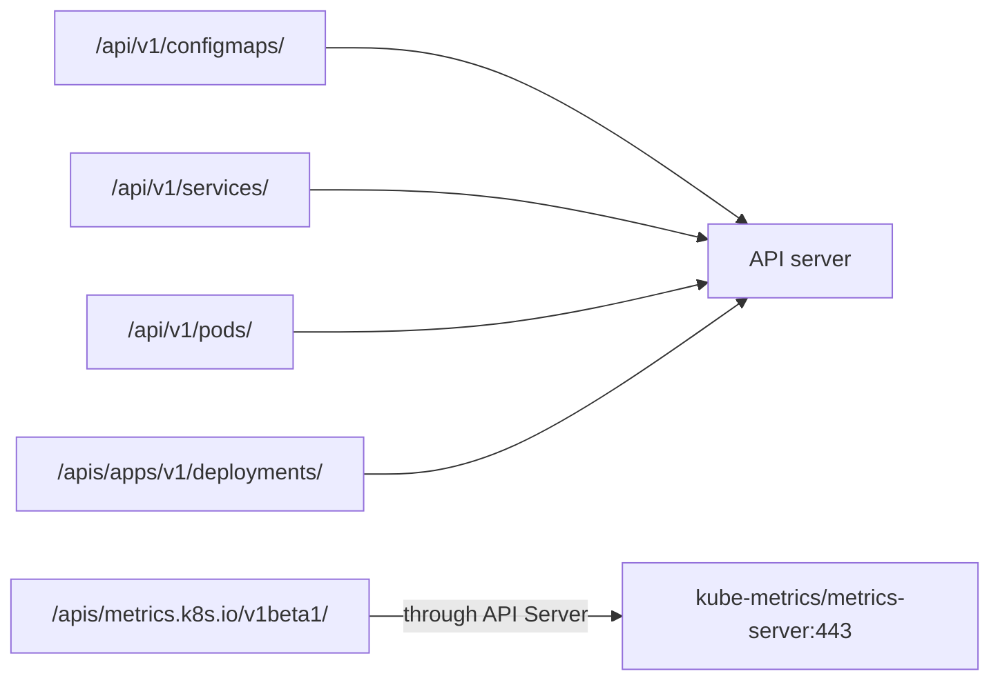
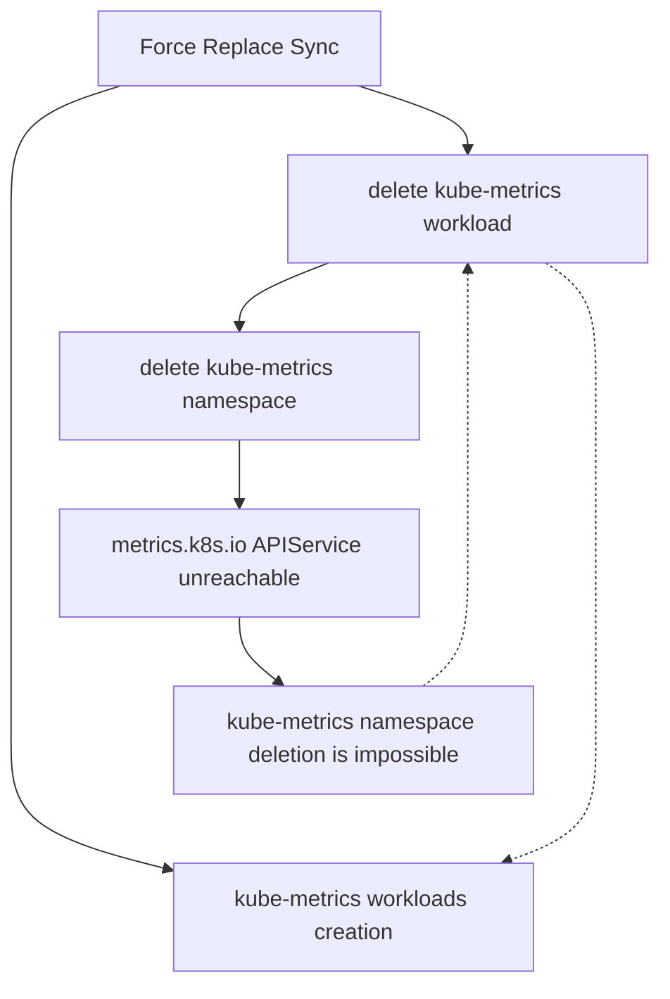

# Rapid Unscheduled Deletion Incident

November 8th 2023 - 16:35

<div grid="~ cols-2 gap-4">
<div>

</div>

<div v-click='1'>

`out of sync` ApplicationSets:

- `kube-contour`
- `kube-log`
- `kube-metrics-ns`
- `kube-metrics-server`
- `kube-otel`

&rarr; all got replaced 💣

</div>
</div>


---
title: metrics.k8s.io circular dependency
hideInToc: true
---

# Unable to delete namespaces


<v-click>

```shell {3,9-11}
> kubectl delete namespace kube-metrics --timeout=10s
namespace "kube-metrics" deleted
error: timed out waiting for the condition on namespaces/kube-metrics

> kubectl get namespace kube-metrics -o=yaml | grep -e "^status" -A8
status:
  conditions:
  - lastTransitionTime: "2024-06-11T17:20:17Z"
    message: 'Discovery failed for some groups, 1 failing: unable to retrieve the
      complete list of server APIs: metrics.k8s.io/v1beta1: stale GroupVersion discovery:
      metrics.k8s.io/v1beta1'
    reason: DiscoveryFailed
    status: "True"
    type: NamespaceDeletionDiscoveryFailure
```
</v-click>

---
title: metrics.k8s.io API Service
hideInToc: true
---

# `metrics.k8s.io` API Service

<div grid="~ cols-2 gap-4">
<div>

```yaml
apiVersion: apiregistration.k8s.io/v1
kind: APIService
metadata:
  name: v1beta1.metrics.k8s.io
spec:
  group: metrics.k8s.io
  service:
    name: metrics-server
    namespace: kube-metrics
    port: 443
  version: v1beta1
```

```console
> kubectl get --raw /apis/metrics.k8s.io/v1beta1/nodes/
{
  "kind": "NodeMetricsList",
  "apiVersion": "metrics.k8s.io/v1beta1",
  "metadata": {},
  "items": [
    ...
```

</div>

<div v-click>




</div>
</div>

---
title: metrics.k8s.io circular dependency diagram
hideInToc: true
---

# `metrics.k8s.io` circular dependency
<div class="grid grid-cols-2 w-full gap-4" >
<div  >



</div>
<div v-click  >

## Consequences

all deleted namespaces stay in `Terminating` state indefinitely

`kube-contour`, `kube-log`, etc. are stuck


<div v-click='at=2' class="v-full flex justify-center items-center ">
<div>

</div>

<div>

_snake biting its tail_
</div>
</div>

</div>
</div>

---
title: breaking the circular dependency
hideInToc: true
---

# `metrics.k8s.io` circular dependency

How to break it ?

````md magic-move
```console
> kubectl  delete apiservice v1beta1.metrics.k8s.io
```

```console
> kubectl foreach --  delete apiservice v1beta1.metrics.k8s.io
```

```console
> kubectl foreach '/^p1-k8s-.*/' -- delete apiservice v1beta1.metrics.k8s.io
Will run command in context(s):
  - p1-k8s-cluster-a
  - p1-k8s-cluster-b
  - p1-k8s-cluster-c
  - p1-k8s-cluster-d
  - p1-k8s-cluster-e
Continue? [Y/n]: Y
p1-k8s-cluster-a | apiservice.apiregistration.k8s.io "v1beta1.metrics.k8s.io" deleted
p1-k8s-cluster-b | apiservice.apiregistration.k8s.io "v1beta1.metrics.k8s.io" deleted
p1-k8s-cluster-c | apiservice.apiregistration.k8s.io "v1beta1.metrics.k8s.io" deleted
p1-k8s-cluster-d | apiservice.apiregistration.k8s.io "v1beta1.metrics.k8s.io" deleted
p1-k8s-cluster-e | apiservice.apiregistration.k8s.io "v1beta1.metrics.k8s.io" deleted

```
````

---
title: Safeguards
hideInToc: true
layout: two-cols
layoutClass: gap-5
---

# Safeguards

How do we prevent this from happening again ?

1. Split ArgoCD instances (nonprod / prod)
1. `syncPolicy` change on critical `ApplicationSet`

````md magic-move {lines: true}

```yaml
apiVersion: argoproj.io/v1alpha1
kind: ApplicationSet
metadata:
  name: kube-metrics-metrics-server
spec:
  template:
    metadata:
      name: "{{server}}-metrics-server"
      namespace: kube-metrics
    spec:
      ...
```

```yaml {6-7}
apiVersion: argoproj.io/v1alpha1
kind: ApplicationSet
metadata:
  name: kube-metrics-metrics-server
spec:
  syncPolicy:
    preserveResourcesOnDeletion: true
  template:
    metadata:
      name: "{{server}}-metrics-server"
      namespace: kube-metrics
    spec:
      ...
```
````

::right::

<v-click >

# Considerations ⚠️

Which other circular dependencies ?

- Any other API Service extension
- Kubernetes resources with a finalizer
  - `PersistentVolumes`
  - `CustomResourceDefinition`
  - ...
- `ValidatingWebhook`
- `MutatingWebhook`


</v-click >

---
title: Conclusion
hideInToc: true
layout: statement
---

# GitOps saved the day

<br>

## Once the circular dependencies were broken

<br>

## **all workloads were back in one minute**

---
title: Demo!
hideInToc: true
layout: statement
---

# Demo