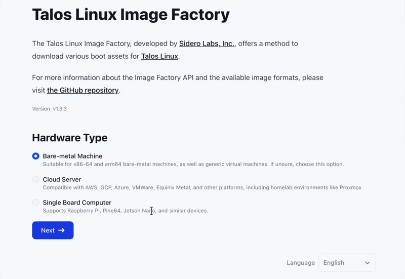

<div class="flex flex-col justify-start items-center" style="min-height: 45vh; padding-top: 0;">

<h1 class="text-6xl font-bold" style="color: #222831;">TOPF</h1>
<h2 class="text-3xl mt-6" style="color: #795649;">Open-Sourcing PostFinance's Tool to Migrate</h2>
<h2 class="text-3xl mt-6" style="color: #795649;">and Manage Talos Linux Clusters</h2>

<p class="mt-10 text-xl" style="color: #222831;"><strong>Clément Nussbaumer</strong> — PostFinance</p>

<div class="mt-6 flex items-center gap-4">
<a href="https://clement.n8r.ch/en/articles/" style="font-size: 1.3rem; color: #222831;" target="_blank">clement.n8r.ch</a>

<a href="https://www.linkedin.com/in/clement-j-m-nussbaumer/" target="_blank" style="color: #222831;"
  class="text-xl icon-btn opacity-100 !border-none"><carbon-logo-linkedin />
</a>
<a href="https://github.com/clementnuss" target="_blank" style="color: #222831;"
  class="text-xl icon-btn opacity-100 !border-none"><carbon-logo-github />
</a>
</div>

</div>


<!--
Introduce myself: SRE at PostFinance, 5+ years operating Kubernetes platform.
Today: the story of how we ended up building and open-sourcing a tool for
managing Talos Linux clusters.
-->

<!-- Outline slide removed — wastes time in a live talk. Restore by uncommenting.
---

# Outline

<br>

<div class="grid grid-cols-2 gap-8">
<div class="bg-white bg-opacity-80 rounded-lg p-6 border border-gray-200 shadow-md">

### 1. Why Talos Linux
Immutable, minimal, secure

</div>
<div class="bg-white bg-opacity-80 rounded-lg p-6 border border-gray-200 shadow-md">

### 2. The ClusterAPI Dead-End
Why we pivoted away from CAPI

</div>
<div class="bg-white bg-opacity-80 rounded-lg p-6 border border-gray-200 shadow-md">

### 3. Introducing TOPF
Layered config, dry-run, lifecycle management

</div>
<div class="bg-white bg-opacity-80 rounded-lg p-6 border border-gray-200 shadow-md">

### 4. Live Demo
And key takeaways

</div>
</div>
-->

---

# Talos Linux
[A minimal O.S. — fewer than 50 binaries](https://www.siderolabs.com/talos-linux)

<div class="grid grid-cols-4 gap-4">
<div class="col-span-2 flex flex-col flex-items-start">

> immutable, minimal, secure
> declarative configuration file and gRPC API [^talos-philosophy]

[^talos-philosophy]: <https://www.talos.dev/v1.12/learn-more/philosophy/>

<br>

```console
$ talosctl services
SERVICE              STATE     HEALTH
apid                 Running   OK
containerd           Running   OK
cri                  Running   OK
etcd                 Running   OK
kubelet              Running   OK
machined             Running   OK
syslogd              Running   OK
trustd               Running   OK
udevd                Running   OK
```

</div>
<div class="col-span-2 h-full flex items-start justify-center">
  <div style="transform: scale(0.9); transform-origin: top;">
    <Excalidraw
      drawFilePath="./drawings/talos-linux.excalidraw"
    />
  </div>
</div>
</div>

<!--
Talos is a Linux distribution designed for Kubernetes. Minimal — fewer than 50 binaries.
Immutable root filesystem, no SSH, everything via gRPC API or declarative config.
This is what drew us to Talos for our infrastructure.
-->

---

# Starting Point
kubeadm + Ansible — battle-tested, but showing its age

<div class="grid grid-cols-2 gap-8 mt-4">
<div class="flex flex-col">

<pre class="topf-tree" style="font-size: 0.62rem; line-height: 1.3;">$ tree tasks
tasks
├── cri/
├── etcd-restore.yml
├── kernel/
├── kubeadm_addons/
├── kubeadm_master/
├── kubeadm_prepare/
├── kubeadm_worker/
├── preflight_check_master/
├── preflight_check_worker/
├── sysctl/
├── master.yml
├── worker.yml
├── reset-master.yml
├── reset-worker.yml
└── …

10 directories, 32 files</pre>

</div>
<div class="flex flex-col justify-center">

#### Infrastructure: Ansible + kubeadm

<div class="mt-1 text-lg leading-relaxed">

- **32** Ansible task files · **1,878** lines of playbooks
- **20** Jinja2 templates — kubeadm, containerd, sysctl, …

</div>

<div class="mt-4 p-3 bg-white bg-opacity-80 rounded-lg border-l-4 border-amber-800 shadow-md text-base">

**mostly idempotent — but not always.** Actions gated on a template's `changed` flag could be silently skipped after a mid-run failure.

</div>

</div>
</div>

<!--
Our starting point was a battle-tested kubeadm + Ansible system: 32 task files,
nearly 1,900 lines of playbooks, 20 Jinja2 templates for kubeadm, containerd,
sysctl and more. Real coverage — init, joins, upgrades, resets, etcd, preflight.

It was mostly idempotent, but not always. The classic trap: some actions — like
regenerating static pod manifests — were gated on the `changed` attribute of a
rendered template. If a job failed between rendering the template and running
the dependent action, the file was already written. On the next run Ansible saw
no change, the conditional didn't fire, and the action was silently skipped.

It wasn't terrible. But it had grown large, it was slow to develop against, and
it was getting harder and harder to maintain. We wanted Talos's declarative,
opinionated node-image model instead.
-->

---

# Our initial plan: ClusterAPI + Talos

<div class="grid grid-cols-5 gap-4">
<div class="col-span-2 flex flex-col flex-items-start">

<br>

- **declarative** cluster lifecycle
- MachineDeployments — Deployments, but for nodes
- Talos provider for machine config
- GitOps-friendly: ArgoCD watches the CRDs

</div>
<div class="col-span-3 h-full flex items-start justify-center">
  <div style="transform: scale(0.85);">
    <Excalidraw
      drawFilePath="./drawings/capi-overview.excalidraw"
    />
  </div>
</div>
</div>

<!--
We planned to migrate to ClusterAPI with Talos. CAPI gives you declarative
cluster management, machine rollouts, GitOps integration. It looked great on
paper. We even gave talks about it.
-->

---

# Change of Plans
why we're not doing ClusterAPI (for now)

<div class="grid grid-cols-2 gap-8 mt-4">
<div class="flex flex-col">

## SideroLabs pivoted

- Talos CAPI providers → **low priority** [^issue]
- focus moved to [**Omni**](https://omni.siderolabs.com/) [^blog]

## Our concerns

- Kubernetes to manage Kubernetes
- in-place upgrades vs. machine replacement
- CAPI complexity vs. our simplicity goal

</div>
<div class="flex flex-col">

## So, our options

- **Omni** — becomes an authn proxy in front of the API server (`client → Omni → apiserver`)
- **Ansible** wrapping `talosctl`? 😬
- a **purpose-built tool** for Talos 🪴

</div>
</div>

[^issue]: <https://github.com/siderolabs/cluster-api-bootstrap-provider-talos/issues/193#issuecomment-2449472526>
[^blog]: <https://www.siderolabs.com/blog/kubernetes-cluster-full-lifecycle-management-without-cluster-api/>

<!--
SideroLabs deprioritized the CAPI providers and shifted focus to Omni. That
left us with: Omni, Ansible-wrapping-talosctl (no thank you), or building our
own purpose-built tool.

The dealbreaker with Omni: it inserts itself as an authentication proxy in
front of the Kubernetes API server — every client request flows
client → Omni → apiserver. We didn't want Omni in the critical path for all
cluster access.

References:
- GitHub issue siderolabs/cluster-api-bootstrap-provider-talos#193
- SideroLabs blog: full lifecycle management without Cluster API
-->

---
class: text-center
---

# Thing

<div class="flex flex-col items-center">
<figure>
  
  <footer><cite style="font-size: 70%;display: block;text-align: center;">The original whiteboard sketch of what would become TOPF</cite></footer>
</figure>
</div>

<!--
This is where it started. A whiteboard sketch of what we needed:
something that takes declarative config, applies it with safety checks,
and handles upgrades. We didn't have a name yet. We just called it "the thing".
-->

---

# TOPF
[Talos Orchestrator by PostFinance](https://github.com/postfinance/topf/)

<div class="grid grid-cols-3 gap-8 mt-6 items-center">
<div class="flex flex-col col-span-1">

<div class="text-3xl font-500" style="color: #795649;">

Not an operator.

Not a controller.

A CLI tool.

</div>

<div class="mt-2 text-base opacity-70 italic">

🪴 *Topf* is also German for a **(plant) pot** — fitting, since it's where our clusters grow.

</div>

<!--  -->

</div>
<div class="flex flex-col col-span-2">


<!--  -->

</div>
</div>

<!--
TOPF is born. A purpose-built tool for Talos. Stateless, minimal Go binary —
no reconciliation loop.

No talosctl dependency — uses the Talos Go SDK directly. Same operations as
talosctl but automated, with pre-flight checks and dry-run diffs. The docs site
walks through all of it.

MIT licensed. brew install postfinance/tap/topf

Fun aside: "Topf" is German for a pot — a cooking pot or a plant pot. A nice
coincidence for a tool that grows and tends our clusters.
-->

---

# What TOPF adds to Talos

<div class="text-xl opacity-70 mt-2">the verbs are familiar (<code>apply</code>, <code>upgrade</code>, <code>reset</code>…) — the workflow is the point</div>

<div class="grid grid-cols-3 gap-6 mt-8">

<div class="bg-white bg-opacity-80 rounded-lg p-5 border border-gray-200 shadow-md">
<div class="text-xl font-700" style="color: #795649;"><carbon-version /> GitOps patch management</div>
<div class="mt-3 text-base leading-relaxed">

- layered YAML patches, kept DRY
- Go templating + sprig
- every change is a reviewable PR

</div>
</div>

<div class="bg-white bg-opacity-80 rounded-lg p-5 border border-gray-200 shadow-md">
<div class="text-xl font-700" style="color: #795649;"><carbon-data-table /> inventory &amp; secrets as data</div>
<div class="mt-3 text-base leading-relaxed">

- nodes from external providers
- secrets resolved at render time
- nothing hardcoded in the repo

</div>
</div>

<div class="bg-white bg-opacity-80 rounded-lg p-5 border border-gray-200 shadow-md">
<div class="text-xl font-700" style="color: #795649;"><carbon-checkmark-outline /> safe rollouts</div>
<div class="mt-3 text-base leading-relaxed">

- pre-flight checks before touching nodes
- dry-run diffs of every change
- controlled, parallel patch + OS upgrades

</div>
</div>

</div>

<div class="mt-6 text-base opacity-60">

Talos already gives you <code>apply</code> / <code>upgrade</code> / <code>reset</code>. TOPF wraps them in a config model, an inventory, and guardrails.

</div>

<!--
This is the important framing. If you know Talos, you already know apply,
upgrade, reset — they're core Talos. So what does TOPF actually add?

Three things. One: GitOps patch management — layered, DRY YAML patches with
templating, where every change goes through a reviewable pull request. Two:
inventory and secrets become data — nodes come from external providers, secrets
are resolved at render time, nothing is hardcoded in the config repo. Three:
safe rollouts — pre-flight checks, dry-run diffs, and controlled parallel
rollouts for both patch changes and OS upgrades.

The commands are familiar. The workflow around them is what TOPF brings.
-->

---

# Layered YAML Patches

<div class="grid grid-cols-2 gap-8">
<div class="flex flex-col">

<pre class="topf-tree">.
├── all/
│   └── <span class="file-dot" style="color:#059669">●</span>01-install-disk.yaml
└── <span class="file-dot" style="color:#2563eb">●</span>topf.yaml</pre>

<div class="mt-4 text-lg opacity-70">

Start simple: one patch applied to **every** node.

</div>

</div>
<div class="flex flex-col">

<div class="file-badge"><span class="file-dot" style="color:#2563eb">●</span>topf.yaml — the entry point</div>

```yaml
clusterName: my-cluster
clusterEndpoint: https://192.168.1.80:6443
talosVersion: 1.13.3
kubernetesVersion: 1.35.5
nodes:
  - host: node1
    ip: 192.168.1.11
    role: control-plane
```

<div class="file-badge"><span class="file-dot" style="color:#059669">●</span>all/01-install-disk.yaml</div>

```yaml
machine:
  install:
    disk: /dev/sda
```

</div>
</div>

<!--
Start with the simplest possible setup. topf.yaml is the entry point: cluster
name, endpoint, Talos + Kubernetes versions, and the node list. Then one patch
in all/ that every node gets — here, where to install Talos. That's a complete,
working config.
-->

---

# Layered YAML Patches

<div class="grid grid-cols-2 gap-8">
<div class="flex flex-col">

<pre class="topf-tree">.
├── all/
│   └── <span class="file-dot" style="color:#059669">●</span>01-install-disk.yaml
├── control-plane/
│   └── <span class="file-dot" style="color:#d97706">●</span>01-allow-scheduling.yaml
├── worker/
│   └── <span class="file-dot" style="color:#9333ea">●</span>01-gpu.yaml
└── <span class="file-dot" style="color:#2563eb">●</span>topf.yaml</pre>

<div class="mt-4 text-lg opacity-70">

Add **role** layers: control-plane and worker get their own patches.

</div>

</div>
<div class="flex flex-col">

<div class="file-badge"><span class="file-dot" style="color:#d97706">●</span>control-plane/01-allow-scheduling.yaml</div>

```yaml
cluster:
  allowSchedulingOnControlPlanes: true
```

<div class="file-badge"><span class="file-dot" style="color:#9333ea">●</span>worker/01-gpu.yaml</div>

```yaml
machine:
  kernel:
    modules:
      - name: nvidia
      - name: nvidia_uvm
```

</div>
</div>

<!--
Now add role-specific layers. Control-plane nodes allow scheduling, workers
load the NVIDIA kernel modules for GPU workloads. Each node only gets the
patches for its role.
-->

---

# Layered YAML Patches

<div class="grid grid-cols-2 gap-8">
<div class="flex flex-col">

<pre class="topf-tree">.
├── all/
│   ├── <span class="file-dot" style="color:#059669">●</span>01-install-disk.yaml
│   └── <span class="file-dot" style="color:#db2777">●</span>02-provider-id.yaml.tpl
├── control-plane/
│   └── <span class="file-dot" style="color:#d97706">●</span>01-allow-scheduling.yaml
├── worker/
│   └── <span class="file-dot" style="color:#9333ea">●</span>01-gpu.yaml
├── node/
│   └── node1/
│       └── <span class="file-dot" style="color:#0891b2">●</span>01-install-disk.yaml
└── <span class="file-dot" style="color:#2563eb">●</span>topf.yaml</pre>

</div>
<div class="flex flex-col">

<div class="file-badge"><span class="file-dot" style="color:#db2777">●</span>all/02-provider-id.yaml.tpl</div>

```yaml
machine:
  kubelet:
    extraArgs:
      provider-id: {{ .Node.Data.uuid }}
```

<div class="file-badge"><span class="file-dot" style="color:#0891b2">●</span>node/node1/01-install-disk.yaml</div>

```yaml
# node1 has different hardware → override
machine:
  install:
    disk: /dev/nvme0n1
```

</div>
</div>


<!--
Two things here. First, templating isn't a node/ thing — the provider-id
template lives in all/ and fills each node's UUID from its data. Second, the
node/ layer is for genuine per-node overrides: node1 has different hardware,
so it overrides the install disk set in all/. More-specific layer wins.
Strategic merge patches only; JSON patches are gone in Talos 1.12+.
-->

---
layout: center
class: text-center
---


# Live Demo 🪴

<p class="text-3xl font-bold mt-4" style="color: #795649;">

[github.com/postfinance/topf](https://github.com/postfinance/topf/)

</p>

<!--
Live demo plan:

1. Two VMs running in UTM (fresh Talos, maintenance mode).
2. Write a minimal topf.yaml with a single control-plane node.
3. topf apply --auto-bootstrap → applies config and bootstraps the cluster
   in one shot.
4. Add a patch to allow scheduling on the control-plane (so we can run
   workloads on a single node).
5. Add the second VM as a worker in topf.yaml, then topf apply → the worker
   joins the cluster.
6. Plot twist: a "leaky vessels" runc CVE drops → we need to patch the OS.
   Run topf upgrade to roll the Talos OS version across the nodes.
-->

---

# What's New

<div class="text-xl opacity-70 mt-2">recent additions since the first release</div>

<div class="grid grid-cols-2 gap-10 mt-8">
<div class="flex flex-col">

#### <carbon-password class="inline" style="color: #795649;" /> <a href="https://github.com/helmfile/vals" target="_blank" style="color: #795649;">vals</a> secret resolution

<div class="text-base opacity-70 mt-1 mb-2">

resolve secrets at render time [^vals]

</div>

```yaml
network:
  interfaces:
    - interface: wg0
      wireguard:
        privateKey: ref+awsssm://secrets/wg.key
```

</div>
<div class="flex flex-col">

#### <carbon-function class="inline" style="color: #795649;" /> <a href="https://github.com/masterminds/sprig" target="_blank" style="color: #795649;">sprig</a> templating

<div class="text-base opacity-70 mt-1 mb-2">

full sprig function library in <code>.yaml.tpl</code> patches [^sprig]

</div>

```yaml
machine:
  nodeLabels:
    region: {{ .Data.region | default "eu" }}
    host: {{ .Node.Host | lower }}
```

</div>
</div>

[^vals]: <https://github.com/helmfile/vals>
[^sprig]: <https://github.com/masterminds/sprig>

<!--
A quick tour of what's landed recently.

On secrets: SOPS has been there from the start, and we just added vals to pull
secrets at render time from Vault, AWS SSM, files and more. Here a WireGuard
private key is fetched from AWS SSM at render time — it never lives in the repo.

Templating got the full sprig library, so patches can do real logic — defaults,
string functions, and so on. And we just added concurrent apply/upgrade with
--max-parallel for bigger clusters. Schematic resolution gets its own slide next.
-->

---

# Schematic Resolution

<div class="text-xl opacity-70 mt-2">

stop juggling Talos Factory [^factory] image hashes

</div>

<div class="grid grid-cols-2 gap-8 mt-6">
<div class="flex flex-col">

<div class="text-xl font-500 mb-2" style="color: #795649;">Before — the Factory UI</div>



</div>
<div class="flex flex-col">

<div class="text-xl font-500 mb-2" style="color: #795649;">After — a manifest in Git</div>

<div class="file-badge"><span class="file-dot" style="color:#db2777">●</span>manifest.yaml.tpl</div>

```yaml
customization:
  extraKernelArgs:
    - node-arg-{{ .Node.Host }}
  systemExtensions:
    officialExtensions:
      - siderolabs/vmtoolsd-guest-agent
```

<div class="file-badge"><span class="file-dot" style="color:#2563eb">●</span>topf.yaml</div>

```yaml
schematicId: "@manifest.yaml.tpl"
```

</div>
</div>

[^factory]: <https://factory.talos.dev/>

<!--
This is the one that's hard to grok if you haven't used the Talos Image Factory.
Normally you go to factory.talos.dev, click through a wizard to pick kernel args
and system extensions, and it hands you back an opaque schematic hash that you
paste into your config. One hash per combination of extensions.

With TOPF you instead keep a manifest in Git — and because it's a .tpl, you can
template it per node. TOPF computes the schematic ID locally from the manifest,
so the source of truth is reviewable YAML, not a hash. Optionally it submits the
schematic to the Factory for you.
-->

---

# Dynamic Providers

<div class="text-xl opacity-70 mt-2">resolve node lists and secrets at runtime from external sources</div>

<div class="grid grid-cols-2 gap-8 mt-6">

<div class="bg-white bg-opacity-80 rounded-lg p-5 border border-gray-200 shadow-md">
<div class="text-xl font-700" style="color: #795649;"><carbon-network-3 /> Nodes Provider</div>

<div class="mt-2 text-sm opacity-70">instead of a static list…</div>

```yaml
# topf.yaml
nodes:
  - host: node1
    ip: 192.168.1.11
    role: control-plane
```

<div class="mt-1 text-sm opacity-70">…point at a binary:</div>

```yaml
# topf.yaml
nodesProvider: ./nodes-from-terraform
```

<div class="mt-2 text-sm opacity-70">e.g. read nodes from a Terraform output, cloud API, or inventory</div>

</div>

<div class="bg-white bg-opacity-80 rounded-lg p-5 border border-gray-200 shadow-md">
<div class="text-xl font-700" style="color: #795649;"><carbon-password /> Secrets Provider</div>

<div class="mt-2 text-sm opacity-70">default: a local SOPS-encrypted bundle…</div>

```yaml
# secrets.yaml (SOPS-encrypted)
secrets:
  bootstrapToken: ENC[AES256_GCM,data:…]
```

<div class="mt-1 text-sm opacity-70">…or fetch it from an external store:</div>

```yaml
# topf.yaml
secretsProvider: ./secrets-from-vault
```

<div class="mt-2 text-sm opacity-70">e.g. Vault, AWS, any external secret store</div>

</div>

</div>

<!--
Dynamic providers are TOPF's plugin system. Instead of hardcoding a node list,
you point TOPF at a binary that returns nodes — the obvious use case is reading
them straight from a Terraform output, but it could be a cloud API or an
inventory system. Provider nodes are merged with any static ones.

Same idea for secrets. By default TOPF keeps a local secrets.yaml — the Talos
secrets bundle — and transparently SOPS-encrypts it. Or you set a secretsProvider
binary that fetches the bundle from an external store. At PostFinance the nodes
provider hits our internal inventory and the secrets provider talks to Vault.
-->

---

# TOPF in GitLab CI
one pipeline per cluster — GitOps for day-2 ops

<div class="grid grid-cols-5 gap-6 mt-4">
<div class="col-span-3">

```yaml
# .gitlab-ci.yml
default:
  before_script:
    - git clone --branch "$CONFIG_REF" "https://$CONFIG_REPO" .

dry-run:
  script: topf apply --dry-run

apply:
  script: topf apply --confirm=false
  when: manual

upgrade:
  script: topf upgrade --confirm=false
  when: manual
```

</div>
<div class="col-span-2 flex flex-col">

```diff
$ topf apply --dry-run

  node2  (Mode: NO_REBOOT)
  machine:
    install:
-     disk: /dev/sda
+     disk: /dev/nvme0n1
    kernel:
      modules:
+       - name: nvidia

  1 node changed — exit code 2
```

</div>
</div>

<!--
This is how we run TOPF in production. Each cluster has its own pipeline. Every
run does a dry-run so you can review the diff; apply and upgrade are both manual
gates — nothing touches the cluster unless someone clicks it. Terraform-style
plan/apply, but for Talos.
-->

---

# TOPF vs Alternatives

<div class="grid grid-cols-3 gap-6 mt-4">
<div class="bg-white bg-opacity-80 rounded-lg p-5 border border-gray-200 shadow-md">

### **scripts / Ansible**

Imperative `talosctl` wrapping

- no safety net, hard to audit

</div>
<div class="bg-white bg-opacity-80 rounded-lg p-5 border border-gray-200 shadow-md">

### **talhelper**

Declarative config generation

- but you still apply & manage lifecycle

</div>
<div class="bg-white bg-opacity-80 rounded-lg p-5 border border-gray-200 shadow-md">

### **Omni** (SideroLabs)

Turnkey managed platform

- authn proxy in front of the API server

</div>
</div>

<div class="mt-12 px-6">

<div class="flex justify-between text-sm opacity-60 mb-3">
<span>least integrated · DIY</span>
<span>turnkey · managed</span>
</div>

<div class="relative">
<div class="absolute left-0 right-0 h-1 rounded-full" style="top: 0.4rem; background: linear-gradient(90deg, #cbbfb9, #795649);"></div>
<div class="relative flex justify-between text-center text-base">

<div class="flex flex-col items-center w-40">
<div class="w-4 h-4 rounded-full border-2 border-white shadow" style="background: #b0a39c;"></div>
<div class="mt-2">scripts / Ansible</div>
</div>

<div class="flex flex-col items-center w-40">
<div class="w-4 h-4 rounded-full border-2 border-white shadow" style="background: #9a8478;"></div>
<div class="mt-2">talhelper</div>
</div>

<div class="flex flex-col items-center w-40">
<div class="w-6 h-6 rounded-full border-2 border-white shadow-lg" style="background: #795649;"></div>
<div class="mt-2 font-700" style="color: #795649;">TOPF</div>
</div>

<div class="flex flex-col items-center w-40">
<div class="w-4 h-4 rounded-full border-2 border-white shadow" style="background: #5d4037;"></div>
<div class="mt-2">Omni</div>
</div>

</div>
</div>
</div>

<!--
The landscape, from least integrated to turnkey. On the left, DIY scripts or
Ansible wrapping talosctl — same imperative idea, no safety net. talhelper is a
step up: it generates configs declaratively, but you still apply and manage
lifecycle yourself. On the far right, Omni: a full managed platform, but it sits
in the critical path as an authn proxy.

TOPF lands in the sweet spot — declarative, layered config and full lifecycle
with safety checks, MIT licensed, no platform to run, no proxy in front of your
API server.
-->

---

# Takeaways

<div class="text-xl opacity-70 mt-2">three lessons that outlast the tool</div>

<div class="flex flex-col gap-10 mt-14">

<div class="flex items-baseline gap-5">
<div class="text-3xl font-bold flex-shrink-0" style="color: #795649;">1</div>
<div class="text-2xl font-500" style="color: #5d4037;">The hard part was never the OS — it was lifecycle</div>
</div>

<div class="flex items-baseline gap-5">
<div class="text-3xl font-bold flex-shrink-0" style="color: #795649;">2</div>
<div class="text-2xl font-500" style="color: #5d4037;">You don't always need a control plane to manage one</div>
</div>

<div class="flex items-baseline gap-5">
<div class="text-3xl font-bold flex-shrink-0" style="color: #795649;">3</div>
<div class="text-2xl font-500" style="color: #5d4037;">Layered, structured config is easy to work with and simple to review</div>
</div>

</div>

<!--
The take-2 framing: pull the camera back from TOPF's features to the
transferable lessons. Even if you never touch Talos, these three hold:

1. Talos solved the node; managing config and upgrades across many clusters is
   the real work — that's where the time goes.
2. A CLI + GitOps + dry-run diffs gave us safety without an operator to run and
   secure. You don't need a control plane to manage one.
3. Layered, templated patches turn every change into a diff a colleague can
   actually review — far better than imperative scripts.

And the meta-lesson: if existing tools don't fit, building your own is
legitimate — and open-sourcing it is how it pays you back.
-->

---
layout: default
---


<div class="flex flex-col items-center justify-center h-full text-center">


<h1 class="text-6xl font-bold mt-6" style="color: #222831;">Thank you!</h1>

<div class="flex items-center gap-8 mt-10 text-lg">
<a href="https://github.com/postfinance/topf/" target="_blank" style="color: #795649;" class="flex items-center gap-2 !border-none">
<carbon-logo-github /> postfinance/topf
</a>
<a href="https://www.talos.dev/" target="_blank" style="color: #795649;" class="flex items-center gap-2 !border-none">
<carbon-bare-metal-server /> talos.dev
</a>
</div>

<div class="mt-10 flex items-center gap-4">
<a href="https://clement.n8r.ch/en/articles/" style="font-size: 1.1rem; color: #222831;" target="_blank">clement.n8r.ch</a>

<a href="https://www.linkedin.com/in/clement-j-m-nussbaumer/" target="_blank" style="color: #222831;"
  class="text-xl icon-btn opacity-100 !border-none"><carbon-logo-linkedin />
</a>
<a href="https://github.com/clementnuss" target="_blank" style="color: #222831;"
  class="text-xl icon-btn opacity-100 !border-none"><carbon-logo-github />
</a>
</div>

<div class="mt-12 text-2xl font-bold" style="color: #5d4037;">Questions? 🪴</div>

</div>
